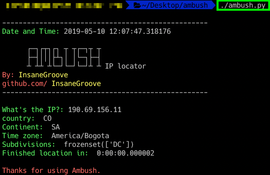

# Ambush

This software has been programmed to locate IPs where we are going to look them up according databases.
The library that has been used is python-geoip which provides access to GeoIP databases, here is the link if you want to look it up https://pythonhosted.org/python-geoip/

# Usage

To use Ambush is very simple you just have to open in terminal the program and type the IP. If you're struggling trying tp get the IP I can recomend you NSLOOKUP from your terminal or website http://www.kloth.net/services/nslookup.php

# Requirements

To use Ambush you will need any OS, the only requirement is have installed Python and the library python-geoip, to see how to install the library, you should go to this link https://pythonhosted.org/python-geoip/.

# Updates

According the time Ambush it’s going to improve its functions adding more features at it. Every feedback is very welcome.

# Look me in Platzi

https://platzi.com/@sampar01
